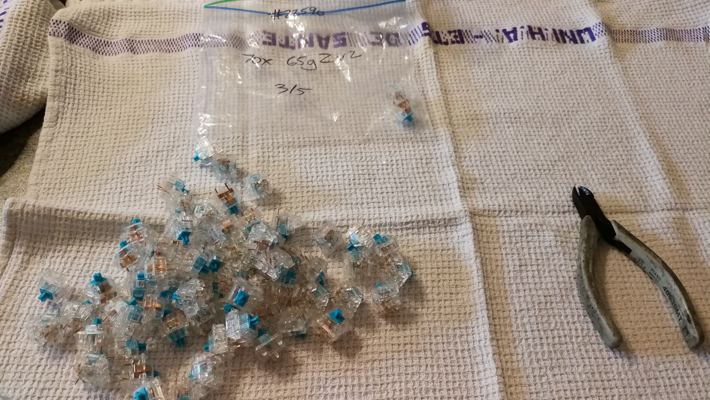
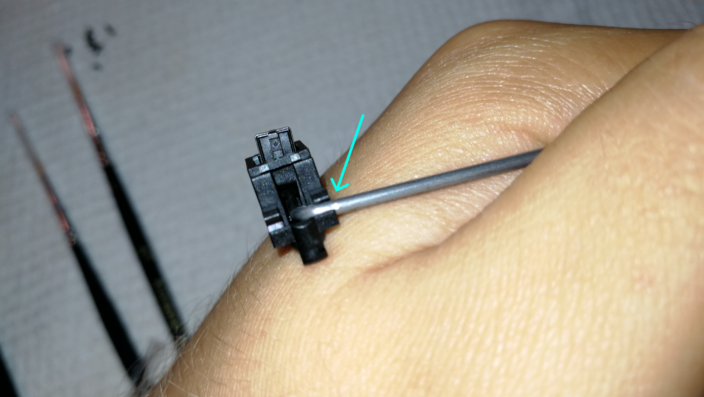
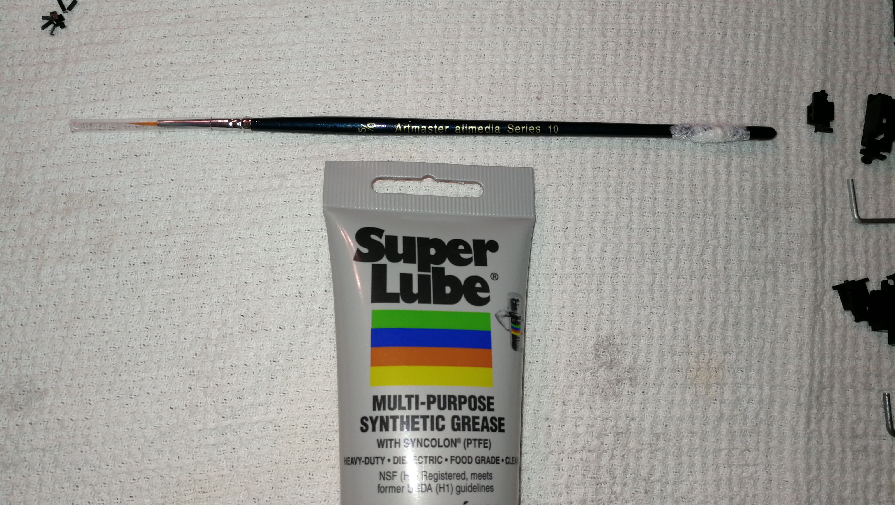
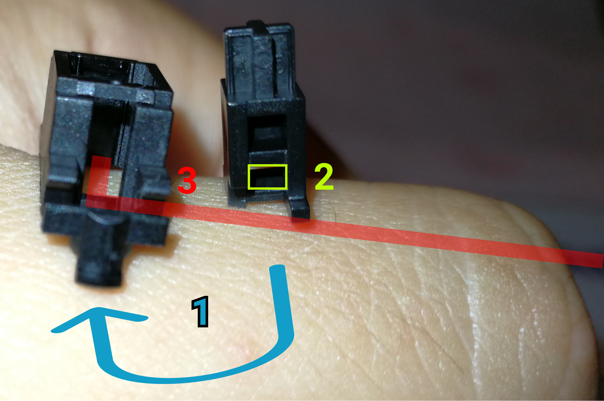
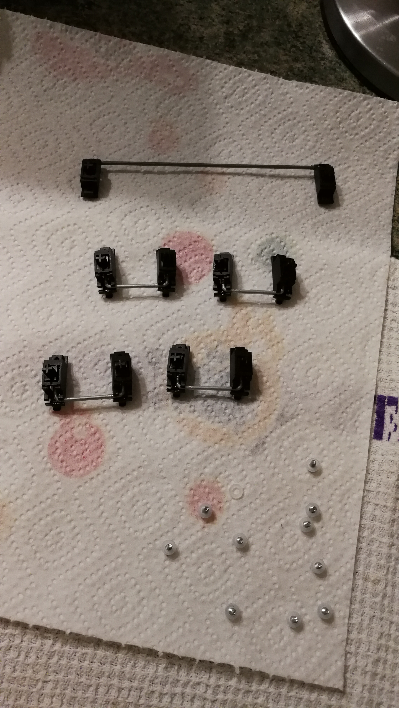
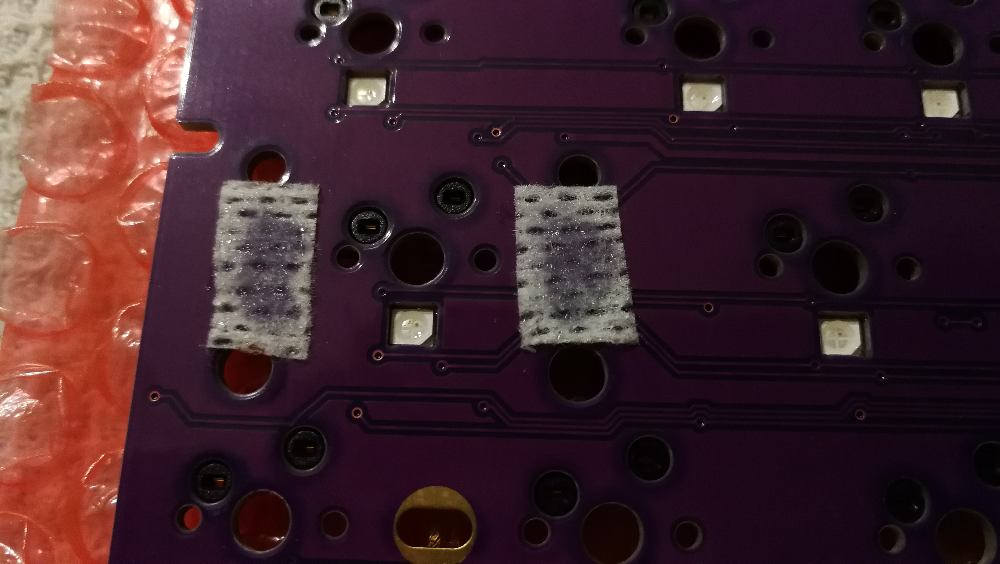
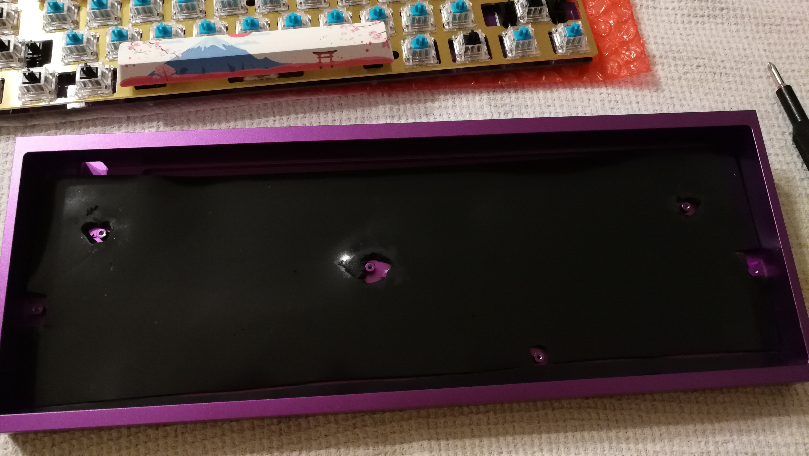
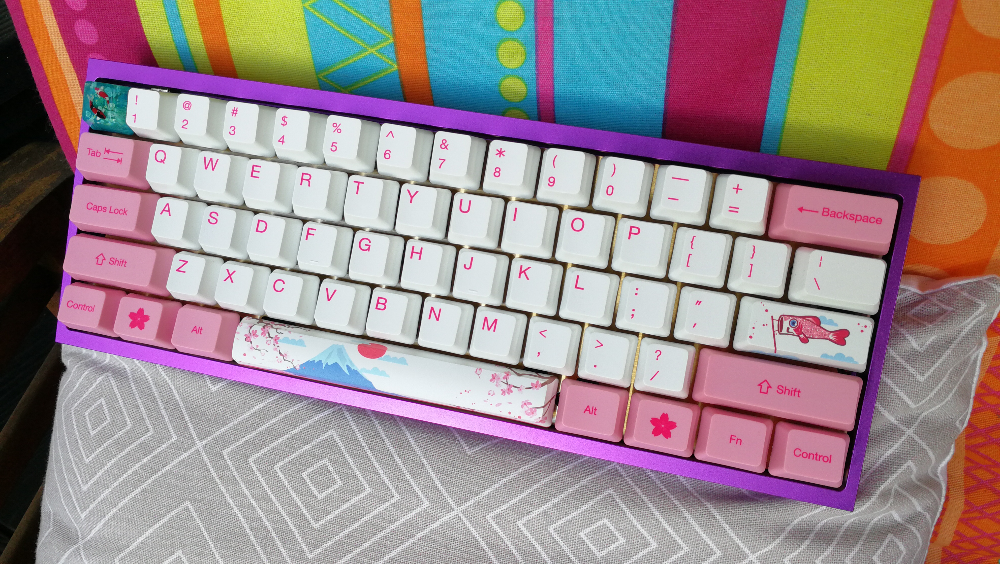

# How to build your first mech keyboard

So, this blog post will be about how to build a mech keyboard.

Meanwhile, you do somehow need to understand some basics about mech keyboards.

That's why, until I do write one, I can recommend the one done by [Drop](https://drop.com/talk/2784/mechanical-keyboards-101-an-introduction-to-the-hobby).

## Get the parts
**Disclaimer**: So, the initial thing will be to fetch the needed components. For that, I've already did the job of choosing something decent. Take note that price-wise, you can start at 150$ and go beyond 1000$.

Here, the budget will be about 330$ but you can also buy a cheaper case or switches. 👌

You can also notice that unlikely some [other well known guide](https://youtu.be/0c8UdKX6GBA), I'm not going to make any solder here, the PCB is indeed _hotswappable_ aka "plug and type".

For several reasons: it's more time consuming - especially in case of a bad soldering - and it's removes the ability of quickly trying switches in the future (thing that may be interesting for somebody new to the hobby). It also requires a soldering iron and some _basic_ dexterity to make something clean.

If it's your thing, feel free to buy a regular PCB and solder it yourself, it's a lot of fun too. 👷‍

----------
En voici la liste avec un lien cliquable sur chaque composant et son prix
- [Case: Tofu] 88$
- [PCB: DZ60RGB ANSI] 55$
- [Switchs: Zilent v2 65g] 84$
- [Plate: brass] 40$
- [Keycaps: Akko World Tour keyset] 43$
- [Stabilisateurs: GMK screw-in] 13$
- [Cable] 5$
- [Switch/Keycap puller] 3$

To that, we may add some additive tools.
- [Dampening foam: Sorbothane] 26$
- [Cheaper alternative] 14$
- [Lube: Superlube] 9$
- [Paint brush set] 10$

[Case: Tofu]: https://kbdfans.com/products/kbdfans-tofu-60-aluminum-case?variant=13786761723962
[PCB: DZ60RGB ANSI]: https://kbdfans.com/products/dz60rgb-ansi-mechanical-keyboard-pcb?variant=22887658782768
[Switchs: Zilent v2 65g]: https://kbdfans.com/products/zealios-tealios-zilents?variant=28744897396784
[Keycaps: Akko World Tour keyset]: https://www.banggood.com/AKKO-World-Tour-Tokyo-114-Keys-Cherry-Profile-Dyesub-PBT-Keycaps-Keycap-Set-for-Mechanical-Keyboard-p-1411856.html?akmClientCountry=FR&&cur_warehouse=USA
[Plate: brass]: https://kbdfans.com/products/brass-60-plate?variant=19387696218170
[Stabilisateurs: GMK screw-in]: https://kbdfans.com/products/gmk-screw-in-stabilizers?variant=22154915348528
[Cable]: https://kbdfans.com/products/usb-c-typec-usb-cable?variant=6868040384570
[Switch/Keycap puller]: https://kbdfans.com/products/product?variant=7446401351738

[Dampening foam: Sorbothane]: https://www.amazon.com/Isolate-Sorbothane-Acoustic-Vibration-Damping/dp/B019GBMG14/ref=sr_1_7?keywords=sorbothane&qid=1561179209&s=gateway&sr=8-7
[Cheaper alternative]: https://www.amazon.com/dp/B0753G2765/?cv_ct_id=amzn1.idea.30QJOPDITFI5D&cv_ct_pg=storefront&cv_ct_wn=aip-storefront&ref=exp_cov_taehatypes_dp_vv_d
[Lube: Superlube]: https://www.amazon.com/Super-Lube-Silicone-Lubricating-Translucent/dp/B07T7Z94PX/ref=sr_1_2?keywords=superlube&qid=1569898255&sr=8-2
[Paint brush set]: https://www.amazon.com/dp/B01D9W6SNS/?cv_ct_id=amzn1.idea.30QJOPDITFI5D&cv_ct_pg=storefront&cv_ct_wn=aip-storefront&ref=exp_cov_taehatypes_dp_vv_d

----------
You should already have some of those to help you during the process
- [ ] metalic twizzers
- [ ] cutting pliers
- [ ] screwdriver
- [ ] scissors
- [ ] band aid

All of those may be available with free shipping and be delivered within business 10 days.


> Ooopa ! Just got the packages, time to start building. 💪


> This is pretty much all the things that you will need.

### Switchs
The most important thing of course.


> Here is a quick overview of some of the best switches out of the box (bought from ZealPC).

From top to bottom, we do have:
- `x70 Zealios v2 67g`: tactiles and light
- `x70 Zilent v2 65g`: tactiles, silent and light
- `x10 Zilent v2 78g`: tactiles, silent and heavier
- `x70 Healios 67g`: linears, silent
- `x10 Rosélios 67g`: linears and silent but **pinky** ! (yes, pure design)


**For our build, we gonna use some Zilent 65 and 78g because of their smoothness and silence.** 😴

Oh and you can use any other _common_ switch too (if it's `MX cherry` compatible).

---
#### Quick reminder of our build


From bottom to top.

At first comes the case, it will essentially impact the sound and the feel. It can be of various price depending of the quality of the materials (and it's thickness).

Then comes some kind of dampening foam to absorb the sound propagated during a keystroke.

Then, our beautiful and programmable PCB. Responsible for a lot of awesome workflow (with QMK).

The stabilizers are above the plate in the schema but they actually need to be mounted before the plate (even if the PCB is hotswappable). They are used on bigger keys like `Caps lock` and `Left Shift`, that may lean on one side of the switch without it when pressed, because a single switch is used for a single keycap (aka `1u`) by nature.

You can follow that [Keycap Ruler link](https://keycap-ruler.com) and compare it to your own keycap location. A stab is usually used on keys that are `2u` or above.

Something similar may be found on the [QMK config](https://config.qmk.fm/#/dztech/dz60rgb/LAYOUT) after toggling on `show key sizes` on the right's side navbar (with the gear on it).

The plate arrives next. It's not mandatory by itself but we will use one in our build. Usually, people tend to go "plateless" for more robust typing feedback. The plate helps keeping the switches sturdy on place, to not let them wobble or simply pop off.

The most important part, are of course the switches. Feeling, sound, feedback are some of the most noticeable things about them. Notice that in our build, we do not need to solder, which is a great way of winning some time and avoid further issues.

Finally, do come the keycaps that suit your texture feel, profile shape, colors and theme. Quite as much important as the switches since they will be in direct contact with your fingers.

> PS: I personally do hate  Signature Plastic ABS plasic on SA profile keycaps. But it is really, a personnal taste at the end of the day. 👌

### Quick overview of the PCB


In pink, we do have our USB-C port.

In blue (follow the numbers order), are our locations when screwing the PCB into the case.

In red, we do have the RGB LED, if it's your thing. 😏

In green, it's the location of the switch's `stem`.

In orange, are the slots for the little plastic pins of a switch, we will cut them just in a few seconds. They may be useful for some plateless build but since we do have a plate and are planning (sometime at least) to remove our switches to try some other ones, they are not so clutch.

In yellow are the slots for the metallic pins that are making the contact when the switch's internals hit the leaf (during a keystroke).


For this part, no need to know a lot of things really.

The switch button shown in blue can be useful thought. It's used to flash the PCB (essentially at the beginning) by setting it's position to `BL` (BootLoader). We will bind a key press for that feature after the first flash. 👼

In red, we do have the Kailh sockets. Those are the ones that allow us to not **have to solder**. You simply need to fit the switch inside of it and tada ! 🎊

Meanwhile, be careful to do it on a flat table surface to not pop off the solder socket 😱 (may happen if you force 💪 at the same time as holding it with one hand mid-air).

## Checking the PCB
Time to check if the PCB is working as expected. Usually they are totally fine.

For that, go to your computer, plus the PCB with the USB port and go to that [link](https://config.qmk.fm/#/test) to check if everything is fine.

For that, close the circruit with some metallic twizzers by shorting the 2 little holes (for the switch's metallic pins). You may notice that the various letters of the keyboard may light when you do that.


If some of the slots shown by the 4 blue arrows are not corresponding to what you'd expect on the screen, do not panic. Some may even not trigger anything at all because used as a `Fn` key.

The goal is to check that those basic circuits are fine !

If nothing is happening and your BootLoader switch is in the `Normal` position, it may be an issue. But before sending it back, let's try to flash the PCB.

I'll write a tutorial soon, on how to do it on Windows, MacOS and Linux. Stay tuned.

## Time to build

### Clipping the switches


> Cut those plastic legs !


> Sideways POV.


> Some more to go. 👩‍🏭

### Modding the stabs (or _stabilizers_)
The 4 little ones will be used for:
- `(left) shift`
- `backspace`
- `enter`
- `(right) shift`

The biggest one will be for the `spacebar`.


So, we gonna start by opening them gently (remove the wire from the plastic elbow).


It's time to clip those small little plastic legs too. That way, your stab will rattle less, will last longer and it will help the overall quietness.


#### [Optionnal but highly recommended] Clip + lube
Gonna lube a bit, to prevent friction.

Take your `Superlube` and your `5/0` sized paint brush. 🖌

Dip the tip of the brush into the tube, but don't take too much of it, only a small layer is needed.

The most important thing to get here is that: it's far better to **have less lube, that to have too much of it**. Trust me, if you overlube it, you will get a bad result too and it will be a _PITA_ to remove, so keep it light. 🍃


> Put a **very thing** lube on this wall, just enough to get it a bit shiny. Do the same for the opposite wall. 😉

Gonna lube the metallic wire that will make contact and potentially rub against everything. Here, you can apply a bit more of lube (essentially for the spacebar).

> Put it pretty much everywhere, essentially on the elbow.

To get it back, look for the correct side.


Here, we gonna need to:
1. put back the little part on the correct side, inside of the base
2. slide the wire into the bottom hole and double check that it is going deep enough
3. clip it on the elbow, as it's initial position

Tada, you should have some `clipped` and `lubed` stabs by now! 🎊


We are going to screw them into the PCB thanks to the screws present in our package. It is used essentially to prevent a short.

Oh and be careful of the **orientation** of the stabs, because there is one ! We are going to mount them as shown above. 👆

#### [Optional] Band-aid

<details>
<summary>Click here to expand</summary>

We are going to make another mod now, aka the `bandaid` one (for more silence, again).

It consists of cutting a small amount of pad, lube it (with the `Superlube` again) and stick it to the correct place on the PCB.


> Watch out to have the width of the pad to be large enough because this is the part responsible for the stab damping.


> Done, with the lube. You can also check out that the lube is changing color - means that there is enough of lube.
</details>

---
Time to mount it all !

> Nothing specific here, pass through the plastic legs and screw the stabs into the indicated slots.


> This is how it should look like with all the stabs modded and mounted.

You could now mount some switches in the corners to apply some equal force (to not bent the plate).

During the switches insertion, you can also put some bubble wrap under below it (the one received in the package will be totally fine for that job).

⚠️ Indeed, I remember you that even if the hotswappable sockets are already soldered, they may break off if there is too much (uneven) force applied on it (like when holding it mid-air). So, if you don't want to get out the soldering iron, keep easy on that part.
Oh and second little warning, did you noticed the 2 reversed holes on the top left ? 🌵⚠️ (it's because of the USB port)

If you ever twist some of the metallic legs of a switch, you can put them back with your finger or a plier.

---
You can now mount some keycaps right now to try out the stabs. It will allow you to not have to get back to them once everything is mounted. On top of enjoying the tasty sound, they are doing. 👌

To mount the keycaps, firmly press on it, like if it's your first time trying to escape VIM by pressing the `esc` key. 😉😆

## Final rush

### Putting all the switches in place
Now, put all of your lovely switches.

> You can like me, put some heavier ones (dark blue colored) on some keys. Personnal preference.


> Check that all the switches are **perfectly** aligned and firmly stuck in the plate, in the good position, without any twist. You can also double check your `PCB` on your computer at this point if you wish, to be sure that every key will be functionnal at the end.

Time to put everything in your aluminium case now.

<!-- #### [Facultatif mais très recommandé] Matière anti-acoustique
<details>
<summary>Cliquez ici pour développer cette partie</summary>
Quand vous allez taper sur votre joli boitier en alu, il y aura des vibrations qui vont se propager un peu partout dans le vide, entre le fond du boitier et votre PCB.

Il est donc possible de réduire cela avec de la matière anti-acoustique. Vous avez globalement le choix de la matière que vous voulez. Vous en avez pour tous les prix, il suffit juste qu'elle ne soit pas trop épaisse ni trop fine.

Ici, j'ai pris de la Sorbothane parce que c'est considéré comme une très bonne gomme anti-acoustique (si on ne part pas sur de la gomme professionnelle, bien sur).

Il faut cependant savoir que c'est une gomme très embêtante a manipuler...

> Voici ce que j'ai reçu. Il suffit maintenant de découper ca proprement (enfin comme on peut !) pour que ca rentre bien au fond du boîtier.

En mesurant bien avec une règle, en découpant de manière droite, vous aurez déjà un bon périmètre.

Il faudra cependant en plus, faire des trous au centre aussi, afin de pouvoir laisser passer les vis a travers et viser le PCB. Pour cela, une lame 🔪 et des ciseaux ✂️ pointus afin de "couper en pinçant au centre" me semble être la meilleure technique.

Il y a peut-être d'autres moyens + propres. Mais dans tous les cas, cela reste une matière pas très pratique a modeler...


> Tada ! Pas fameux hein...? Mais ca donne un ordre d'idéee sur les découpes nécessaires et ca vous donne un visuel du rendu !
</details> -->

### Mounting it into the case

> Now, put the PCB in place by passing the USB part in first. Also, double check that the Bootloader swtich is in the **NORMAL** position. 🙏


> Screw **gently** (to not break the PCB). Use the golden screws and aim for the correct locations (can be found [here](#PCB) if you forgot).

### Keycaps

> Same as before, put the reamining keycaps in place by pressing them firmly. Try to respect the `rows` too ! Indeed, the row of `QWERTY` and ``` `12345 ``` have some specific profile, and as so, you cannnot interchange them or you will have a hell of a strange typing experience.

## Result 💮



> Congratz for your first build ! 🎊

## Misc stuff
Some more stuff.


> Do not forget to put your non-skid legs under your case, it will help you get more grip and will protect your case.

> PS: The small hole in the case is essentially used to flash the PCB by triggering a specific button. We don't really care of that one since we will flash it in another way (so don't worry about it). It here because it's a universal case with a large compatibility with other PCBs.

### How to flash your PCB ?
_"Ok dude, it's fine and all but how do I actually custom my keeb with some fancy marcos, mapping, l33t RGB ???"_

It gonna depend of your OS in first place, let's say that it's really simple on MacOS, simple enough on Linux and annoying on Windows. I will do a guide soon for the 3 OSes.
Until then, you can follow the somewhat messy [official guide](https://docs.qmk.fm/#/newbs_getting_started?id=set-up-your-environment).

MechMerlin (a community member) also did a [great playlist](https://www.youtube.com/watch?v=tx54jkRC9ZY&list=PLZlceRZZjRugJFL-vnenYnDrbMc6wu_e_&index=3) on how to flash it. You can follow that one until I release my own guide for it.

### What's next ?

If you have some questions, remarks or suggestions, feel free to hit me up on Twitter [@kissu_io](https://twitter.com/kissu_io) or send me at [hello@kissu.io](mailto:hello@kissu.io) ! 👍

On my part, I will soon release some other guides on:
- [ ] properly & simply installing QMK on any OS
- [ ] silencing your whole keyboard to make it even more silent
- [ ] introduction to some advances QMK features
