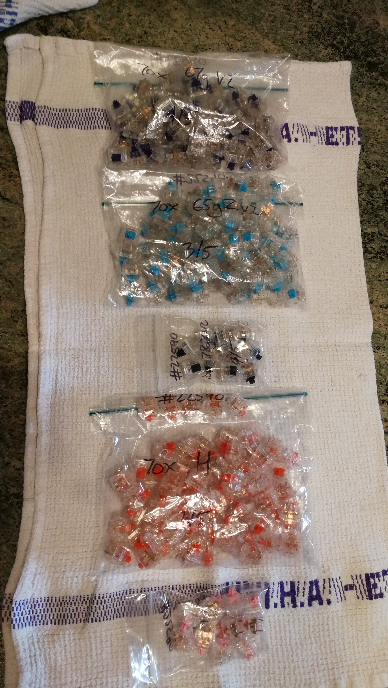
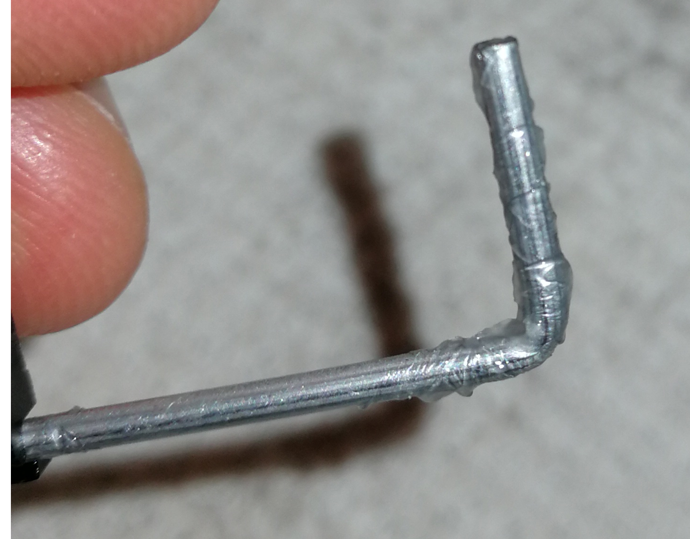
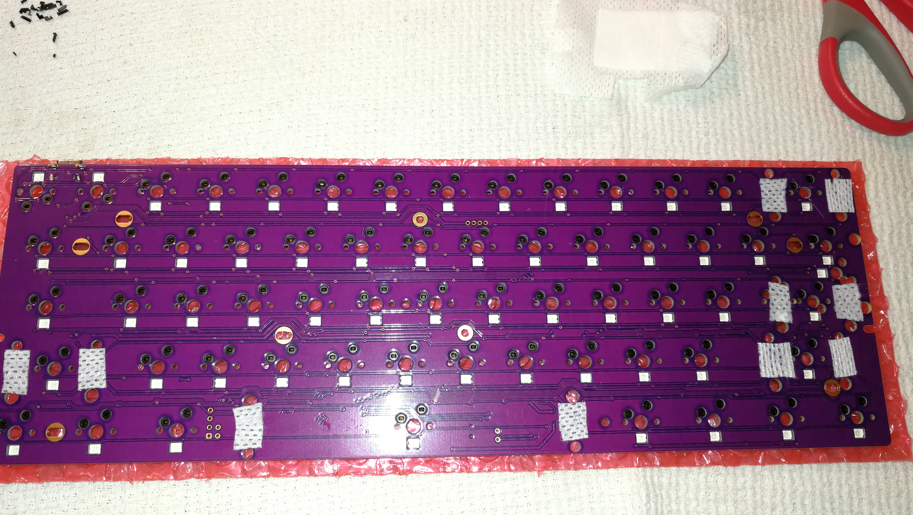
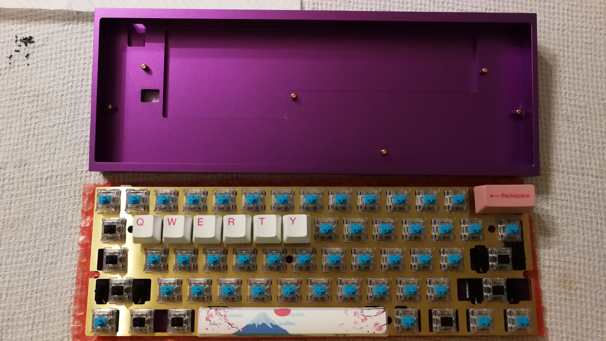

# Buildez votre premier meca

Vous voulez avoir votre propre meca custom, tout beau et brillant ?

C'est parfait alors. Je vais vous montrer comment monter un 60%, silencieux, avec des switchs tactiles, des finitions de qualite et le tout sans meme avoir besoin de souder !

# Table de matieres
  - [Rassembler les pièces](#Rassembler-les-pi%C3%A8ces)
  - [Presentation des composants](#Presentation-des-composants)
    - [Switchs](#Switchs)
      - [Petit rappel du dessous d'un switch](#Petit-rappel-du-dessous-dun-switch)
    - [PCB](#PCB)
  - [Verification du PCB](#Verification-du-PCB)
  - [Mise en pratique](#Mise-en-pratique)
    - [Clip des switchs](#Clip-des-switchs)
    - [Modding des stabs](#Modding-des-stabs)
      - [[Facultatif mais tres recommande] Clip + lube](#Facultatif-mais-tres-recommande-Clip--lube)
      - [[Facultatif] Band-aid mod](#Facultatif-Band-aid-mod)
  - [Partie finale](#Partie-finale)
    - [Remplissage des switchs](#Remplissage-des-switchs)
      - [[Facultatif mais tres recommande] Matiere anti-accoustique](#Facultatif-mais-tres-recommande-Matiere-anti-accoustique)
    - [Montage dans le boitier](#Montage-dans-le-boitier)
    - [Keycaps](#Keycaps)
  - [Divers](#Divers)
    - [Comment flasher mon PCB ?](#Comment-flasher-mon-PCB)
    - [Besoin d'aide / reclamation / autre ?](#Besoin-daide--reclamation--autre)
        - [Todo](#Todo)

## Rassembler les pièces
Alors, nous allons tout d’abord parler de ce qu’il vous faudra commander. En effet, il faut des pièces un peu spéciales pour faire un clavier mécanique.

**Disclaimer**: je vous propose ici un build pour un certain budget. Mais il faut savoir qu'un meca complet peut aller de 150€ a 1000€+, certains composants choisis auraient pu etre moins chers et d'autres plus chers. Je tiens juste a vous presenter le build et je ne parlerai pas forcement des differentes alternatives disponibles.

En voici la liste avec un lien cliquable sur chaque composant et son prix

| Composant                         | Intérêt                                                                       | Details                                                               | Prix  |
| --------------------------------- | ----------------------------------------------------------------------------- | --------------------------------------------------------------------- | :---: |
| [Case: Tofu]                      | Le boîtier dans lequel vous allez mettre tout le contenu de votre clavier     | En alu, sobre, simple                                                 |  88$  |
| [PCB: DZ60RGB ANSI]               | Ce qui va envoyer vos inputs lorsque vous allez appuyer sur une touche        | Pas besoin de souder/dessouder                                        |  55$  |
| [Switchs: Zilent v2 65g]          | Tout ce qui donne au méca sa nature si particulière                           | Très chers mais font partie des meilleurs switchs tactiles silencieux |  84$  |
| [Plate: brass]                    | Ajoute de la stabilité et donne un feeling différent                          | _Optionnel mais recommandé_                                           |  40$  |
| [Keycaps: Akko World Tour keyset] | Voici ce sur quoi vous allez tapoter au quotidien                             | PBT, profile OEM, pas trop cher et ANSI standard                      |  43$  |
| [Stabilisateurs: GMK screw-in]    | Nécessaires pour les touches dites modifiers (Enter, Shift, Backspace etc...) | Simples a monter et avec un bon son                                   |  13$  |
| [Cable]                           |                                                                               | USB-C                                                                 |  5$   |
| [Switch/Keycap puller]            | Va vous permettre d'enlever vos switchs/keycaps sans les endommager           |                                                                       | 3,50$ |
| **Total**                         |                                                                               |                                                                       | 294€  |

| Composant **optionnel**          | Intérêt                                                         | Details                                                          | Prix   |
| -------------------------------- | --------------------------------------------------------------- | ---------------------------------------------------------------- | ------ |
| [Isolant acoustique: Sorbothane] | Permettra d'étouffer la résonance du son dans votre case        |                                                                  | 26$    |
| [Alternative a la Sorbothane]    |                                                                 |                                                                  | 14,40€ |
| [Lubrifiant: Superlube]          | Va rendre vos stabs plus silencieux et avec un meilleur feeling | **Uniquement** pour les stabs                                    | 8,60€  |
| [Pinceaux]                       | Pour appliquer différents types de lubrifiants                  | Pratique si vous voulez rendre votre clavier + silencieux/smooth | 12,21€ |
| [Vis en nylon]                   | Si vous préférez cela aux rondelles en plastique fournies       |                                                                  | 4,19€  |
| **Total**                        |                                                                 |                                                                  | 48€    |

[Case: Tofu]: https://kbdfans.com/products/kbdfans-tofu-60-aluminum-case?variant=13786761723962
[PCB: DZ60RGB ANSI]: https://kbdfans.com/products/dz60rgb-ansi-mechanical-keyboard-pcb?variant=22887658782768
[Switchs: Zilent v2 65g]: https://kbdfans.com/products/zealios-tealios-zilents?variant=28744897396784
[Keycaps: Akko World Tour keyset]: https://www.banggood.com/AKKO-World-Tour-Tokyo-114-Keys-Cherry-Profile-Dyesub-PBT-Keycaps-Keycap-Set-for-Mechanical-Keyboard-p-1411856.html?akmClientCountry=FR&&cur_warehouse=USA
[Plate: brass]: https://kbdfans.com/products/brass-60-plate?variant=19387696218170
[Stabilisateurs: GMK screw-in]: https://kbdfans.com/products/gmk-screw-in-stabilizers?variant=22154915348528
[Cable]: https://kbdfans.com/products/usb-c-typec-usb-cable?variant=6868040384570
[Switch/Keycap puller]: https://kbdfans.com/products/product?variant=7446401351738

[Isolant acoustique: Sorbothane]: https://www.amazon.com/Isolate-Sorbothane-Acoustic-Vibration-Damping/dp/B019GBMG14/ref=sr_1_7?keywords=sorbothane&qid=1561179209&s=gateway&sr=8-7
[Alternative a la Sorbothane]: https://www.amazon.fr/SilverStone-SST-SF01-Isolation-acoustique-dordinateur/dp/B0044UZWL4/ref=sr_1_3?__mk_fr_FR=%C3%85M%C3%85%C5%BD%C3%95%C3%91&keywords=Silverstone+acoustique&qid=1561589303&s=gateway&sr=8-3
[Lubrifiant: Superlube]: https://www.amazon.fr/Multipurpose-synth%C3%A9tique-bas%C3%A9-sur-graisse/dp/B00C5014K8/ref=sr_1_1?__mk_fr_FR=%C3%85M%C3%85%C5%BD%C3%95%C3%91&keywords=multipurpose+graisse&qid=1562943680&s=gateway&sr=8-1
[Pinceaux]: https://www.amazon.fr/Artists-Modelmakers-Extra-Detail-ArtMaster/dp/B00A39DAMS/ref=sr_1_1?__mk_fr_FR=%C3%85M%C3%85%C5%BD%C3%95%C3%91&keywords=modelmakers+set+of+8+artmaster&qid=1562943790&s=gateway&sr=8-1
[Vis en nylon]: https://www.amazon.fr/sourcingmap%C2%AE-Phillips-Nylon-croix-pi%C3%A8ces/dp/B012TAFF58/ref=sr_1_fkmr3_1?__mk_fr_FR=%C3%85M%C3%85%C5%BD%C3%95%C3%91&keywords=tete+philips+tete+croix+nylon&qid=1562943741&s=gateway&sr=8-1-fkmr3

Il vous faudra ensuite quelques outils que vous devez déjà avoir chez vous:
- [ ] pincette métallique
- [ ] pince coupante
- [ ] tournevis
- [ ] ciseaux
- [ ] pansements

Presque tous les composants sont en livraison gratuite et sont livres sous une dizaine de jours.

> Voila, maintenant que vous avez tout commande et recu, il est temps de passer au build en lui meme !

> Voici un peu ce que donnent toutes les pieces une fois rassemblees.

## Presentation des composants

### Switchs
De loin la chose la plus importante de toutes.

> Je vais vous presenter les switchs que j'ai achete pour quelques builds dernierement.

De haut en bas, nous avons:
- `x70 Zealios v2 67g`: tactiles et legers
- `x70 Zilent v2 65g`: tactiles, silencieux et legers
- `x10 Zilent v2 78g`: tactiles, silencieux et plus lourds
- `x70 Healios 67g`: lineaires, silencieux
- `x10 Rosélios 67g`: lineaires et silencieux comme au dessus mais en edition pink ! (oui, seulement esthetique donc)

Je vais pas rentrer dans les details mais j'ai globalement pris ce qui se fait de mieux de chez ZealPC (et non, je ne suis pas sponso pour quoi que ce soit dans ce guide).

**Le build utilisera donc des Zilent 65 et 78g pour sa super tactilité et aussi son silence.**

Mais vous pouvez utiliser quasi n'importe quel autre switch _commun_ du style pour ce build (avec le top en croix).

---
#### Petit rappel du dessous d'un switch

Nous avons la partie centrale, qui permettra au `stem` de plonger au fond du switch (et qui sert aussi de support).

Les 2 pins noirs en plastique sur le cote peuvent etre coupes avec une pince coupante et ne servent essentiellement qu'a ajouter un peu de stabilite (en pratique, c'est inutile).

Les 2 pins metalliques qui permettent de fermer le circuit électrique du PCB lorsque vous actionnez le switch.

### PCB
Maintenant, passons au PCB.

Regardons le devant du PCB dans un premier temps.

En rose nous avons notre port USB-C.

En bleu nous avons les differentes localisations pour monter notre PCB dans notre case avec les vis dorees (fournies), ainsi que leur ordre.

En rouge, vous pouvez voir la petite LED qui rendra votre PCB tout beau et brillant, si c'est quelque chose que vous appreciez.

En vert, vous avez l'endroit ou s'insere le `stem`.

En orange, les fameux emplacements pour les pins en plastique. En pratique, on ne va pas s'amuser a les garder.

En jaune, les emplacements pour les pins metalliques.

Pour ce qui est de l'arriere, vous n'aurez pas besoin de connaitre beaucoup de transistors ou quoi que ce soit.

Il suffit juste de connaitre le switch indique en bleu, qui pourra servir a flasher le PCB en le passant en position `BL` (BootLoader). Mais on verra qu'il y a une autre solution aussi.

En rouge, vous pouvez observer les sockets hotswappables de chez Kailh. Ces petits embouts nous permettront **de ne pas avoir besoin de souder**, il suffira juste de plug le switch dedans !

## Verification du PCB
Bon, maintenant passons a la verification du PCB en verifiant que tout marche bien !

Pour cela, allez sur votre ordinateur, branchez le PCB en USB et allez a [cette adresse](https://config.qmk.fm/#/test) pour verifier que tout marche comme il faut.

Il vous suffit pour cela de fermer le circuit a l'aide de votre pincette entre les 2 trous qui vont accueillir les pattes du switch. Vous devriez voir les touches s'illuminer au fur et a mesure que vous avancez.

Si jamais certains des 4 endroits indiques par la fleche ne correspondent pas a ce que vous voulez, pas de panique. Idem si certains d'entre eux ne font rien, il peuvent en effet s'apparenter a une touche `Fn`.

Le but du jeu etant de verifier que les circuits classiques sont ok !

Si jamais vous n'avez aucun signal et que votre interrupteur au dos est en position `Normal`. Vous avez peut-etre un soucis et il faudra peut-etre dans ce cas flasher votre PCB.

Voir [ici](#Comment-flasher-mon-PCB) pour la procedure a suivre.

## Mise en pratique

### Clip des switchs

> Vous vous souvenez des 2 pattes inutiles d'un switch presentes plus haut ? Eh bien nous allons a present les couper a l'aide de votre pince coupante !

> Voici une autre vue de profil pour mieux voir le resultat.

> Allez, plus que quelqu'uns !

### Modding des stabs
Les stabilisateurs (ou _stabs_) sont utilises pour des keycaps un peu plus longs.
Nous allons nous occuper de ceux-ci.
Les 4 petits serviront essentiellement pour les key suivants:
- `(left) shift`
- `backspace`
- `enter`
- `(right) shift`

Le plus long sera lui pour la `spacebar`.

Nous allons d'abord commencer par les demonter, en douceur.

> Forcez un peu sur cette partie la afin de separer les 3 parties.

Prenez maintenant la partie qui etait a l'interieur.

> Il faut ici couper les 2 parties fines qui ne servent a rien de bon. Grace a cela, votre stab sera davantage silencieux, s'abimera moins et durera plus longtemps !

#### [Facultatif mais tres recommande] Clip + lube
Nous allons maintenant mettre un peu de lubrifiant pour eviter les frottements.

Prenez votre `Superlube` et votre pinceau prefere. Il faut juste qu'il ne soit pas trop epais, ici j'ai du `5/0`.

Trempez le bout du pinceau dans le tube et enlever le surplus de lubrifiant: il faut une toute petite couche.

S'il faut retenir quelque chose de cette partie, c'est que: **il vaut mieux mettre pas assez de lubrifiant, qu'en mettre trop** !

En effet, si vous surlubrifiez, le resultat aura l'effet contraire de ce a quoi vous vous attendez. Puis il vous faudra tout demonter et essuyer avec de l'essuie-tout proprement, donc...essayez d'avoir la main legere.

> Il faut donc mettre une **tres fine** couche de lubrifiant sur cette paroi, juste ce qu'il faut pour qu'elle soit brillante.

N'oubliez pas la paroi opposee bien sur. 😉

Ensuite, il faut lubrifier la tige metallique qui va venir se frotter un peu partout. Ici, vous pouvez mettre un peu plus de lube (surtout si c'est pour la spacebar).

> Il en faudra un peu partout et surtout au niveau du coude ou il y aura pas mal de frottements.

Pour le remettre, vous avez pu voir que la partie interieure a 2 faces: une avec 1 trou et l'autre avec 2.

Ici, il faudra:
1. remettre la petite partie dans le bon sens, a l'interieur de la base
2. glisser la tige dans le trou du bas et veiller a ce qu'il arrive au bout de la partie interieure
3. clipser le tige au niveau du coude comme a son etat initial

Voila, vous devriez maintenant avoir tous les stabs `clipped` et `lubed` ! 🎊

On va maintenant les viser au PCB grace aux vis fournies et aux rondelles en plastiques (ces dernieres sont utilisees afin d'eviter de creer un court-circuit avec le PCB et les vis).

> On peut acheter et utiliser des vis en nylon aussi. Pratique si on n'a pas de rondelles sous la main et qu'on veut un truc un peu plus solide.

Je tiens a attirer votre attention sur le **sens** des stabs. Pour le layout classique ANSI que l'on build ici, il nous faudra les monter comme cela sur le PCB, ne vous trompez pas ! 😱

#### [Facultatif] Band-aid mod

Cliquez ici pour développer

Nous allons voir comment faire un autre petit mod maintenant, a savoir le `bandaid` mod (`+ de silence`).

Cela consiste simplement a decouper un morceau de pansement, le lubrifier (toujours avec la `Superlube`) et le coller au bond endroit sur le PCB.

> Voici l'emplacement. Veillez surtout a ce que la largeur de la bande sois assez epaisse afin que le stab qui viendra taper sur le PCB soit amorti.

> Voici, avec le lubrifiant. Il suffit que le pansement change un petit peu de couleur pour savoir qu'il y a suffisament de lubrifiant.

---
C'est le moment de monter le tout !

> Rien de complexe ici. Passez les pattes en plastique dans les fentes dans un premier temps.
>
> Puis les autres, mettez une rondelles puis vissez !

> Voici le rendu que ca devrait avoir une fois tous les stabs montes (et entirement moddes).

Vous pouvez maintenant monter quelques switchs dans les coins (histoire d'appliquer une force constante sur le PCB) pour tester stabs.

Pour mettre en place vos switchs, pensez a mettre du papier bulle en dessous (celui que vous avez recu dans la boite fera tres bien l'affaire).

⚠️ En effet, ce PCB hotswappable est tres bien mais les gens recommandent de ne pas inserer les switchs en le tenant en main (sinon, vous pourriez demonter les sockets et...il faudrait sortir le fer a souder dans ce cas la...). Posez donc votre PCB a plat et appuyez fermement sur le switchs en visant bien les trous adequats !

⚠️ Warning 2.0 ⚠️ Faites aussi attention aux 2 emplacements tout en haut a gauche, il sont inverses, en raison de la presence du port USB.

Si jamais vous tordez vos pins en metal (ceux du switch), ce n'est pas bien grave. Vous pourrez les remettre droits a l'aide d'une pince. 😉

---
Vous pouvez monter quelques keycaps des maintenant histoire de tester les stabs. Ca vous evitera de le faire plus tard si jamais vous avez mal monte/mis trop de lube/autre et vous pourrez en outre apprecier le doux son de vos stabs parfaitement moddes.

Pour les monter, il suffit juste de l'enfoncer comme si vous ecrasiez le switch, pas de crainte a avoir ici ! 😄

## Partie finale

### Remplissage des switchs
Il vous suffit maintenant de mettre tous vos switchs dans les emplacements dedies.

> Vous pouvez mettre comme moi, des switchs un peu plus lourds sur certaines touches si vous voulez. Preference personnelle !

> Faitez cependant attention a ce que tous les switchs soient bien mis en place comme des petits soldats, que la haut de la plate soit bien au niveau de la partie en butee du switch et que tout est bien enfonce, sans torsion quelconque.

Maintenant, vous pouvez des a present mettre le tout au fond de votre joli case en alu.

Si cependant, vous souhaitez faire un dernier mod (pour encore + de silence) avant, lisez ce qui suit.

#### [Facultatif mais tres recommande] Matiere anti-accoustique

Cliquez ici pour développer

Quand vous allez taper sur votre joli boitier en alu, il y aura des vibrations qui vont se propager un peu partout dans le vide entre le fond du boitier et votre PCB.

Il est donc possible de reduire cela avec de la matiere anti-accoustique. Vous avez globalement le choix de la matiere que vous voulez. Vous en avez pour tous les prix, il suffit juste qu'elle ne soit pas trop epaisse ni trop fine.

Ici, j'ai pris de la Sorbothane parceque c'est considere comme une tres bonne gomme anti-accoustique (si on ne pars pas sur de la gomme pressionnelle, bien sur).

Il faut cependant savoir que c'est une genre de gomme tres embetante a manipuler...

> Voici ce que j'ai recu. Il suffit maintenant de decouper ca proprement (enfin comme on peut !) pour que ca rentre bien au fond du boitier.

En mesurant bien avec une regle, en decoupant de maniere droite, vous aurez deja un bon perimetre.

Il faudra cependant en plus, faire des trous au centre aussi, afin de pouvoir laisser passer les vis a travers et viser le PCB. Pour cela, une lame 🔪 et des ciseaux ✂️ pointus afin de "couper en pincant au centre" me semble etre la meilleure technique.

Il y a peut-etre d'autres moyens + propres. Mais dans tous les cas, cela reste une matiere pas tres pratique a modeler...

> Tada ! Pas fameux hein...? Mais ca donne un ordre d'idee sur les decoupes necessaires et ca vous donne un visuel du rendu !

### Montage dans le boitier

> Il ne reste plus qu'a doucement glisser le tout dans le boitier en passant l'encoche USB en premier.
>
> ⚠️ Verifiez bien que le switch situe au dos du PCB dont on parle [ici](#PCB) est sur la position **NORMAL**.

> Il suffit maintenant de viser aux endroits indiques plus haut en y allant **tout doucement**: il faudrait pas casser le PCB a ce stade en forcant comme un bourrin...
>
> Utilisez bien les vis dorees et voici un [rappel de l'ordre](#PCB) si jamais vous en avez besoin !

### Keycaps

> Le plus facile maintenant ! Montez vos super keycaps en appuyant bien au fond pour que le `stem` du switch s'enfonce bien au fond de la keycap.
>
> Oh et pensez aussi que toutes les lignes (celle des chiffres, Qwer, Asdf, Zxcv, Ctrl) ont un profil bien special donc ne les intervertissez pas si vous ne voulez pas avoir une experience bizarre au toucher.

### Resultat 💮

> Feliciations pour votre premier build ! 🎊

## Divers
Quelques dernieres petites choses.

> N'oubliez pas de monter les petits pads anti-derappants histoire de ne pas abimer votre boitier et aussi pour avoir davantage de grip sur le bureau.

> PS: Le petit trou dans le boitier sert a appuyer sur un bouton au dos du PCB. Nous n'en avons pas besoin ici car notre PCB se flasher d'une autre facon (il n'y a donc aucun bouton a cet emplacement), le boitier est juste prevu pour etre universel et s'addapter au plus grand nombre de PCB.

### Comment flasher mon PCB ?
_"Ok, c'est bien beau d'avoir un clavier mais comment je custom les macros, mapping, regle la RGB etc moi ??"_

Cela depend de votre OS dans un premier lieu et...je vais vous rediriger vers un autre guide car celui-la est base sur le build d'un meca, puis il est deja suffisament long comme ca.

Voici un [lien vers une playlist](https://youtu.be/VR53Wo9Z960?list=PLZlceRZZjRugJFL-vnenYnDrbMc6wu_e_) en anglais de la procedure a suivre. C'est un guide temporaire, en attendant que notre communaute redige un guide specifique et detaille !

### Besoin d'aide / reclamation / autre ?

Si jamais ce tuto n'est pas suffisament clair, que vous souhaitez y apporter des ameliorations ou que vous etes fan de Christian Clavier, n'hesitez pas a visiter notre [Discord](https://discord.gg/TZ5kBcQ), on sera heureux de vous accueillir ! 💪🏻🎉

-----

-----
##### Todo
- [ ] make better photos ? (light, crop, more indications)
- [ ] re-read myself
- [ ] add some photos ?
- [ ] fix some mistakes (add more lube on stab wires ?) vu que c'est mon premier build
