# How to build your first mech keyboard

So, this blog post will be about how to build a mech keyboard.

Meanwhile, you do somehow need to understand some basics about mech keyboards.

That's why, until I do write one, I can recommend the one done by [Drop](https://drop.com/talk/2784/mechanical-keyboards-101-an-introduction-to-the-hobby).

# Table of contents
- [How to build your first mech keyboard](#how-to-build-your-first-mech-keyboard)
- [Table of contents](#table-of-contents)
  - [Get the parts](#get-the-parts)
  - [Presentation des composants](#presentation-des-composants)
    - [Switchs](#switchs)
      - [Petit rappel du dessous d'un switch](#petit-rappel-du-dessous-dun-switch)
    - [PCB](#pcb)
  - [Verification du PCB](#verification-du-pcb)
  - [Mise en pratique](#mise-en-pratique)
    - [Clip des switchs](#clip-des-switchs)
    - [Modding des stabs](#modding-des-stabs)
      - [[Facultatif mais très recommandé] Clip + lube](#facultatif-mais-tr%c3%a8s-recommand%c3%a9-clip--lube)
      - [[Facultatif] Band-aid](#facultatif-band-aid)
  - [Partie finale](#partie-finale)
    - [Mise en place des switchs](#mise-en-place-des-switchs)
      - [[Facultatif mais très recommandé] Matière anti-acoustique](#facultatif-mais-tr%c3%a8s-recommand%c3%a9-mati%c3%a8re-anti-acoustique)
    - [Montage dans le boîtier](#montage-dans-le-bo%c3%aetier)
    - [Keycaps](#keycaps)
  - [Resultat 💮](#resultat-%f0%9f%92%ae)
  - [Divers](#divers)
    - [Comment flasher mon PCB ?](#comment-flasher-mon-pcb)
    - [Besoin d'aide / réclamation / autre ?](#besoin-daide--r%c3%a9clamation--autre)
        - [Todo](#todo)

## Get the parts
**Disclaimer**: So, the initial thing will be to fetch the needed components. For that, I've already did the job of choosing something decent. Take note that price-wise, you can start at 150$ and go beyond 1000$.

Here, the budget will be about 330$ but you can also buy a cheaper case or switches. 👌

You can also notice that unlikely some [other well known guide](https://youtu.be/0c8UdKX6GBA), I'm not going to make any solder here, the PCB is indeed _hotswappable_ aka "plug and type".

For several reasons: it's more time consuming - especially in case of a bad soldering - and it's removes the ability of quickly trying switches in the future (thing that may be interesting for somebody new to the hobby). It also requires a soldering iron and some _basic_ dexterity to make something clean.

If it's your thing, feel free to buy a regular PCB and solder it yourself, it's a lot of fun too. 👷‍

----------
En voici la liste avec un lien cliquable sur chaque composant et son prix
- [Case: Tofu] 88$
- [PCB: DZ60RGB ANSI] 55$
- [Switchs: Zilent v2 65g] 84$
- [Plate: brass] 40$
- [Keycaps: Akko World Tour keyset] 43$
- [Stabilisateurs: GMK screw-in] 13$
- [Cable] 5$
- [Switch/Keycap puller] 3$

To that, we may add some additive tools.
- [Dampening foam: Sorbothane] 26$
- [Cheaper alternative] 14$
- [Lube: Superlube] 9$
- [Paint brush set] 10$

[Case: Tofu]: https://kbdfans.com/products/kbdfans-tofu-60-aluminum-case?variant=13786761723962
[PCB: DZ60RGB ANSI]: https://kbdfans.com/products/dz60rgb-ansi-mechanical-keyboard-pcb?variant=22887658782768
[Switchs: Zilent v2 65g]: https://kbdfans.com/products/zealios-tealios-zilents?variant=28744897396784
[Keycaps: Akko World Tour keyset]: https://www.banggood.com/AKKO-World-Tour-Tokyo-114-Keys-Cherry-Profile-Dyesub-PBT-Keycaps-Keycap-Set-for-Mechanical-Keyboard-p-1411856.html?akmClientCountry=FR&&cur_warehouse=USA
[Plate: brass]: https://kbdfans.com/products/brass-60-plate?variant=19387696218170
[Stabilisateurs: GMK screw-in]: https://kbdfans.com/products/gmk-screw-in-stabilizers?variant=22154915348528
[Cable]: https://kbdfans.com/products/usb-c-typec-usb-cable?variant=6868040384570
[Switch/Keycap puller]: https://kbdfans.com/products/product?variant=7446401351738

[Dampening foam: Sorbothane]: https://www.amazon.com/Isolate-Sorbothane-Acoustic-Vibration-Damping/dp/B019GBMG14/ref=sr_1_7?keywords=sorbothane&qid=1561179209&s=gateway&sr=8-7
[Cheaper alternative]: https://www.amazon.com/dp/B0753G2765/?cv_ct_id=amzn1.idea.30QJOPDITFI5D&cv_ct_pg=storefront&cv_ct_wn=aip-storefront&ref=exp_cov_taehatypes_dp_vv_d
[Lube: Superlube]: https://www.amazon.com/Super-Lube-Silicone-Lubricating-Translucent/dp/B07T7Z94PX/ref=sr_1_2?keywords=superlube&qid=1569898255&sr=8-2
[Paint brush set]: https://www.amazon.com/dp/B01D9W6SNS/?cv_ct_id=amzn1.idea.30QJOPDITFI5D&cv_ct_pg=storefront&cv_ct_wn=aip-storefront&ref=exp_cov_taehatypes_dp_vv_d

----------
You should already have some of those to help you during the process
- [ ] metalic twizzers
- [ ] cutting pliers
- [ ] screwdriver
- [ ] scissors
- [ ] band aid

All of those may be available with free shipping and be delivered within business 10 days.

> Ooopa ! Just got the packages, time to start building. 💪

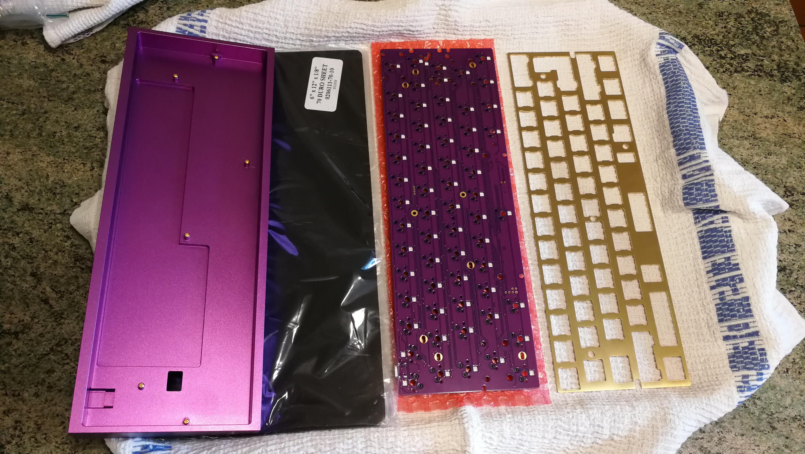

> This is pretty much all the things that you will need.

## Presentation des composants

### Switchs
The most important thing of course.

> Here is a quick overview of some of the best switches out of the box (bought from ZealPC).

From top to bottom, we do have:
- `x70 Zealios v2 67g`: tactiles and light
- `x70 Zilent v2 65g`: tactiles, silent and light
- `x10 Zilent v2 78g`: tactiles, silent and heavier
- `x70 Healios 67g`: linears, silent
- `x10 Rosélios 67g`: linears and silent but **pinky** ! (yes, pure design)

**For our build, we gonna use some Zilent 65 and 78g because of their smoothness and silence.**

Oh and you can use any other _common_ switch too (if it's `MX cherry` compatible).

---
#### Petit rappel du dessous d'un switch

Nous avons la partie centrale, qui permettra au `stem` de plonger au fond du switch (et qui sert aussi de support une fois dans le PCB).

Les 2 pins noirs en plastique sur le côté peuvent être sectionnés avec une pince coupante et ne servent essentiellement qu'à ajouter un peu de stabilité (en pratique, c'est inutile).

Les 2 pins métalliques qui permettent de fermer le circuit électrique du PCB lorsque vous actionnez le switch.

### PCB
Maintenant, passons au PCB.

Regardons le devant du PCB dans un premier temps.

En rose nous avons notre port USB-C.

En bleu nous avons les différentes localisations pour monter notre PCB dans notre case avec les vis dorées (fournies), ainsi que leur ordre.

En rouge, vous avez une des nombreuses LED qui composent ce PCB. Si c'est votre tasse de thé, vous serez servis ici !

En vert, vous avez l'endroit où s'insère le `stem`.

En orange, les fameux emplacements pour les pins en plastique. En pratique, on ne va pas rien y introduire donc.

En jaune, les emplacements pour les pins métalliques.

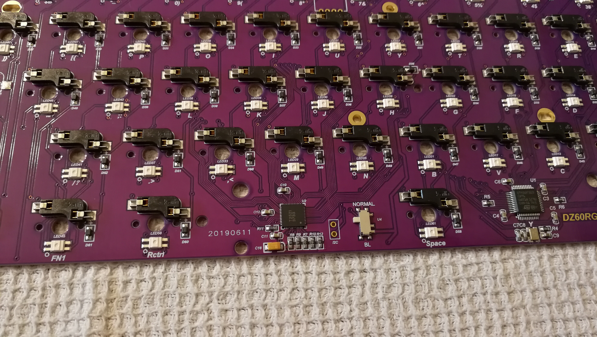
Pour ce qui est de l'arrière, vous n'aurez pas besoin de connaître beaucoup de transistors ou quoi que ce soit.

Il suffit juste de connaître le switch indique en bleu, qui pourra servir à flasher le PCB en le passant en position `BL` (BootLoader). Mais on verra qu'il y a une autre solution aussi.

En rouge, vous pouvez observer les sockets hot swappables de chez Kailh. Ces petits embouts nous permettront **de ne pas avoir besoin de souder**, il suffira juste de plug le switch dedans !

## Verification du PCB
Bon, maintenant passons a la verification du PCB en vérifiant que tout marche bien !

Pour cela, allez sur votre ordinateur, branchez le PCB en USB et allez à [cette adresse](https://config.qmk.fm/#/test) pour vérifier que tout marche comme il faut.

Il vous suffit pour cela de fermer le circuit à l'aide de votre pincette entre les 2 trous qui vont accueillir les pattes du switch. Vous devriez voir les touches s'illuminer au fur et à mesure que vous avancez.

Si jamais certains des 4 endroits indiqués par la flèche ne correspondent pas à ce que vous voulez, pas de panique. Idem si certains d'entre eux ne font rien, il peuvent en effet s'apparenter à une touche `Fn`.

Le but du jeu étant de vérifier que les circuits classiques sont ok !

Si jamais vous n'avez aucun signal et que votre interrupteur au dos est en position `Normal`, vous avez peut-être un soucis et il faudra dans ce cas flasher votre PCB.

Voir [ici](#Comment-flasher-mon-PCB) pour la procédure à suivre.

## Mise en pratique

### Clip des switchs

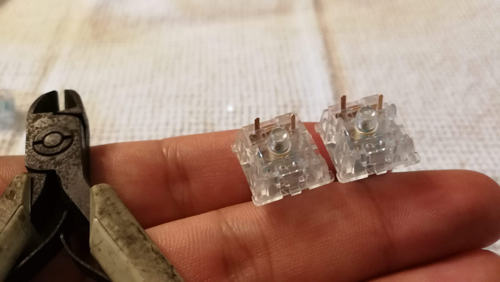
> Vous vous souvenez des 2 pattes inutiles d'un switch présentés plus haut ? Eh bien nous allons a présent nous en débarrasser à l'aide d'une pince coupante !

> Voici une autre vue de profil pour mieux voir le résultat.

> Allez, plus que quelque uns !

### Modding des stabs
Les stabilisateurs (ou _stabs_) sont utilisés pour des keycaps un peu plus longs.
Nous allons nous occuper de ceux-ci.
Les 4 petits serviront essentiellement pour les key suivants:
- `(left) shift`
- `backspace`
- `enter`
- `(right) shift`

Le plus long sera lui pour la `spacebar`.

Nous allons d'abord commencer par les démonter, en douceur.

> Forcez un peu sur cette partie là afin de séparer les 3 parties.

Prenez maintenant la partie qui était à l'intérieur.

> Il faut ici couper les 2 petites pattes qui ne servent à rien de bon. Grâce à cela, votre stab sera davantage silencieux, s'abîmera moins et durera plus longtemps !

#### [Facultatif mais très recommandé] Clip + lube
Nous allons maintenant mettre un peu de lubrifiant pour éviter les frottements.

Prenez votre `Superlube` et votre pinceau préféré. Il faut juste qu'il ne soit pas trop épais, ici j'ai du `5/0`.

Trempez le bout du pinceau dans le tube et enlevez le surplus de lubrifiant: il faut une toute petite couche.

S'il faut retenir quelque chose de cette partie, c'est que: **il vaut mieux mettre pas suffisamment de lubrifiant, qu'en mettre trop** !

En effet, si vous sur-lubrifiez, le résultat aura l'effet contraire de ce à quoi vous vous attendez. Puis il vous faudra tout démonter et essuyer avec de l'essuie-tout proprement, donc...essayez d'avoir la main légère.

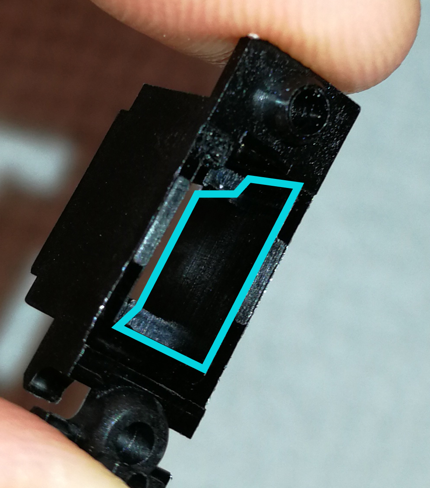
> Il faut donc mettre une **très fine** couche de lubrifiant sur cette paroi, juste ce qu'il faut pour qu'elle soit brillante.

N'oubliez pas la paroi opposée bien sur. 😉

Ensuite, il faut lubrifier la tige métallique qui va venir se frotter un peu partout. Ici, vous pouvez mettre un peu plus de lube (surtout si c'est pour la spacebar).

> Il en faudra un peu partout et surtout au niveau du coude où y aura pas mal de frottements.

Pour le remettre, vous avez pu voir que la partie intérieure a 2 faces: une avec 1 trou et l'autre avec 2.

Ici, il faudra:
1. remettre la petite partie dans le bon sens, à l'intérieur de la base
2. glisser la tige dans le trou du bas et veiller à ce qu'il arrive au bout de la pièce intérieure
3. clipser le tige au niveau du coude comme à son état initial

Voilà, vous devriez maintenant avoir tous les stabs `clipped` et `lubed` ! 🎊
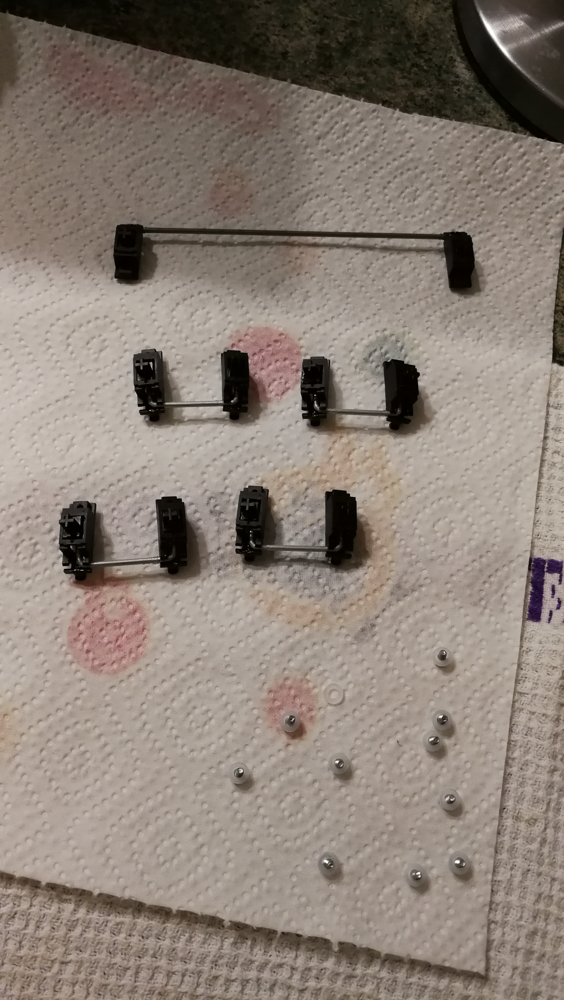

On va maintenant les viser au PCB grâce aux vis fournies et aux rondelles en plastiques (ces dernières sont utilisées afin d'éviter de créer un court-circuit avec le PCB et les vis).

> On peut acheter et utiliser des vis en nylon aussi. Pratique si on n'a pas de rondelles sous la main et qu'on veut un truc un peu plus solide.

Je tiens à attirer votre attention sur le **sens** des stabs. Pour le layout classique ANSI que l'on build ici, il nous faudra les monter comme cela sur le PCB, ne vous trompez pas ! 😱

#### [Facultatif] Band-aid

Cliquez ici pour développer cette partie

Nous allons voir comment faire un autre petit mod maintenant, à savoir le `bandaid` mod (`+ de silence`).

Cela consiste simplement à découper un morceau de pansement, le lubrifier (toujours avec la `Superlube`) et le coller au bon endroit sur le PCB.

> Voici l'emplacement. Veillez surtout à ce que la largeur de la bande soit assez épaisse afin que le stab qui viendra taper sur le PCB soit amorti.

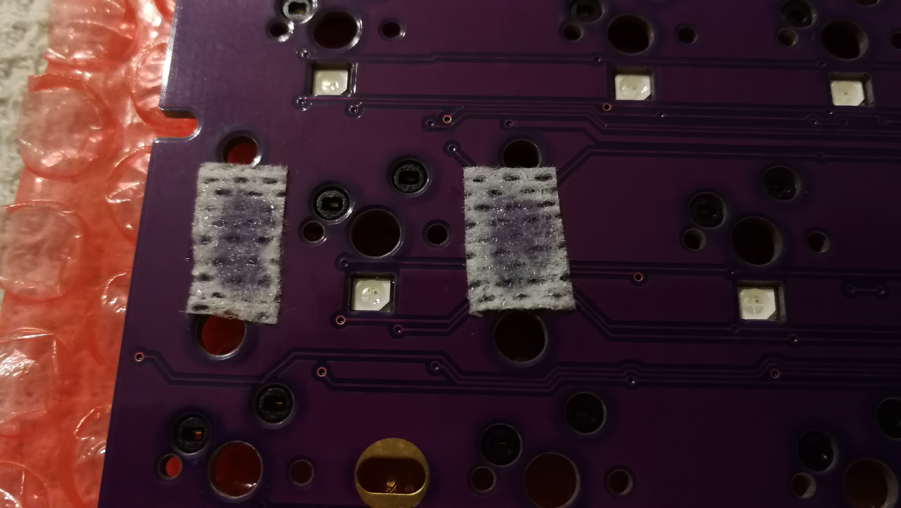
> Voici, avec le lubrifiant. Il faut que le pansement change un petit peu de couleur pour savoir s'il y a suffisamment de lubrifiant.

---
C'est le moment de monter le tout !

> Rien de complexe ici. Passez les pattes en plastique dans les fentes dans un premier temps.
>
> Puis les autres, mettez une rondelles puis vissez !

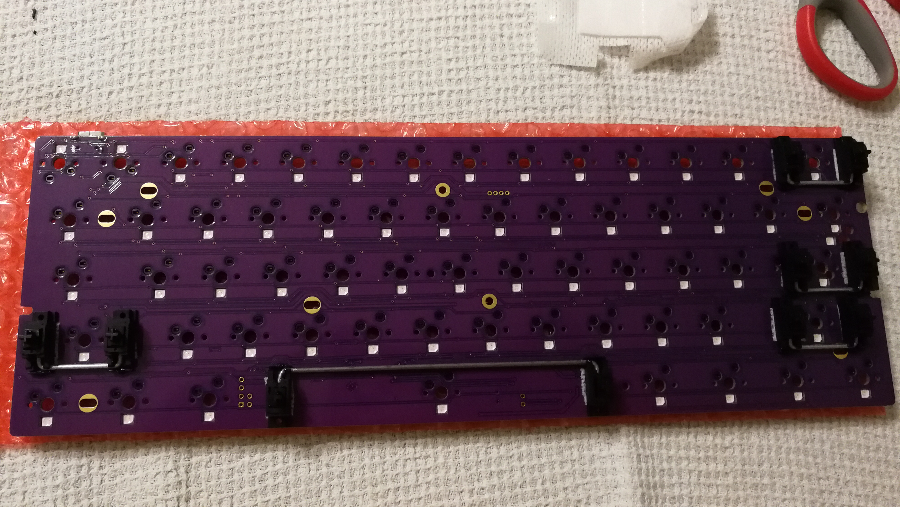
> Voici le rendu que ca devrait avoir une fois tous les stabs montés (et entièrement modés).

Vous pouvez maintenant monter quelques switchs dans les coins (histoire d'appliquer une force constante sur la plate, pour ne pas la tordre) afin de tester les stabs.
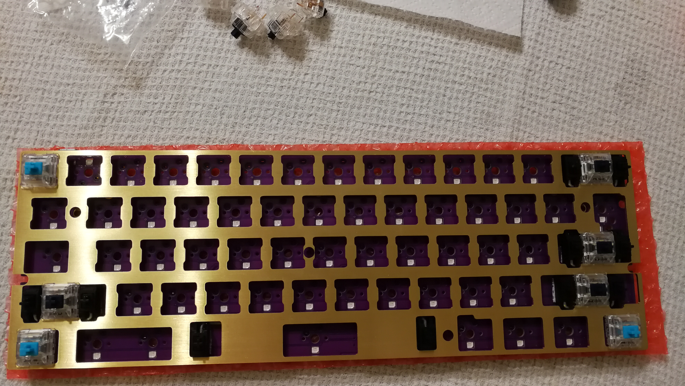
Pour mettre en place vos switchs, pensez à mettre du papier bulle en dessous (celui que vous avez reçu dans la boite fera très bien l'affaire).

⚠️ En effet, ce PCB hot swappable est très bien mais les gens recommandent de ne pas insérer les switchs en le tenant en main (sinon, vous pourriez démonter les sockets et...il faudrait sortir le fer à souder dans ce cas là...). Posez donc votre PCB à plat et appuyez fermement sur le switchs en visant bien les trous adéquats !

⚠️ Warning 2.0 ⚠️ Faites aussi attention aux 2 emplacements tout en haut à gauche, il sont inversés, en raison de la présence du port USB.

Si jamais vous tordez vos pins en métal (ceux du switch), ce n'est pas bien grave. Vous pourrez les remettre droits à l'aide d'une pince. 😉

---
Vous pouvez monter quelques keycaps dès maintenant histoire de tester les stabs. Ca vous évitera de le faire plus tard si jamais vous avez mal monté/mis trop de lube/autre et vous pourrez en outre apprécier le doux son de vos stabs parfaitement moddés.

Pour les monter, il suffit juste de l'enfoncer comme si vous écrasiez le switch, pas de crainte à avoir ici ! 😄

## Partie finale

### Mise en place des switchs
Il vous suffit maintenant de mettre tous vos switchs dans les emplacements dédiés.

> Vous pouvez mettre comme moi, des switchs un peu plus lourds sur certaines touches si vous voulez. Préférence personnelle !

> Faites cependant attention à ce que tous les switchs soient bien mis en place comme des petits soldats, que la haut de la plate soit bien au niveau de la partie en butée du switch et que tout est bien enfoncé, sans torsion quelconque.
>
> Vous pouvez refaire une passe et contrôler sur votre PC, comme plus haut, que tous les switchs marchent toujours correctement.

Vous pouvez dès à présent mettre le tout au fond de votre joli case en alu.

Si cependant, vous souhaitez faire un dernier mod (pour encore + de silence) avant, lisez ce qui suit.

#### [Facultatif mais très recommandé] Matière anti-acoustique

Cliquez ici pour développer cette partie

Quand vous allez taper sur votre joli boitier en alu, il y aura des vibrations qui vont se propager un peu partout dans le vide, entre le fond du boitier et votre PCB.

Il est donc possible de réduire cela avec de la matière anti-acoustique. Vous avez globalement le choix de la matière que vous voulez. Vous en avez pour tous les prix, il suffit juste qu'elle ne soit pas trop épaisse ni trop fine.

Ici, j'ai pris de la Sorbothane parce que c'est considéré comme une très bonne gomme anti-acoustique (si on ne part pas sur de la gomme professionnelle, bien sur).

Il faut cependant savoir que c'est une gomme très embêtante a manipuler...
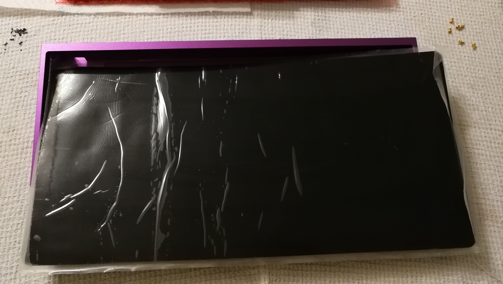
> Voici ce que j'ai reçu. Il suffit maintenant de découper ca proprement (enfin comme on peut !) pour que ca rentre bien au fond du boîtier.

En mesurant bien avec une règle, en découpant de manière droite, vous aurez déjà un bon périmètre.

Il faudra cependant en plus, faire des trous au centre aussi, afin de pouvoir laisser passer les vis a travers et viser le PCB. Pour cela, une lame 🔪 et des ciseaux ✂️ pointus afin de "couper en pinçant au centre" me semble être la meilleure technique.

Il y a peut-être d'autres moyens + propres. Mais dans tous les cas, cela reste une matière pas très pratique a modeler...

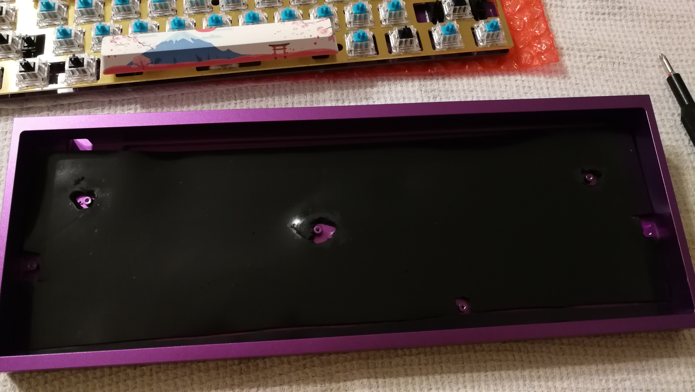
> Tada ! Pas fameux hein...? Mais ca donne un ordre d'idéee sur les découpes nécessaires et ca vous donne un visuel du rendu !

### Montage dans le boîtier

> Il ne reste plus qu'à doucement glisser le tout dans le boitier en passant l'encoche USB en premier.
>
> ⚠️ Vérifiez bien que le switch situé au dos du PCB dont on parle [ici](#PCB) est sur la position **NORMAL**.

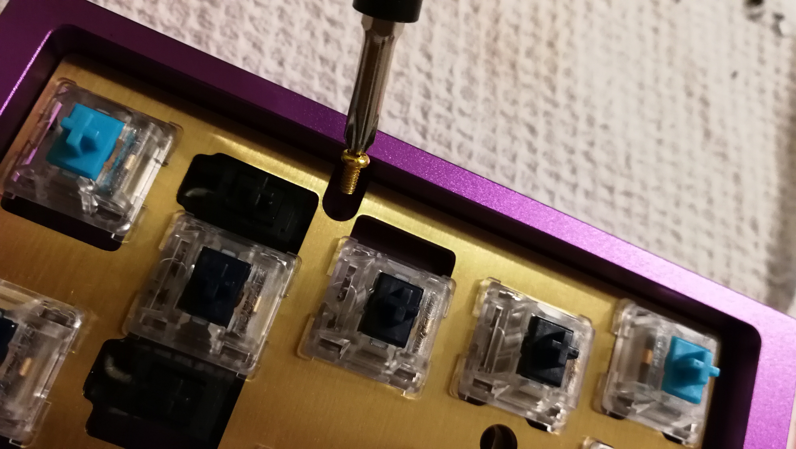
> Il suffit maintenant de viser aux endroits indiqués plus haut en y allant **tout doucement**: il faudrait pas casser le PCB a ce stade en forçant comme un bourrin...
>
> Utilisez bien les vis dorées et voici un [rappel de l'ordre](#PCB) si jamais vous en avez besoin !

### Keycaps
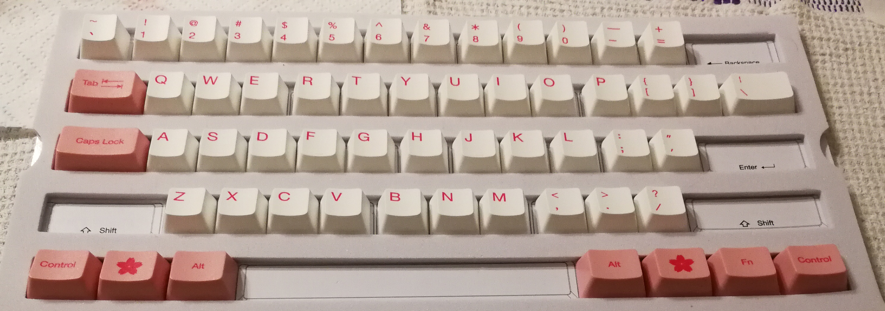
> Le plus facile maintenant ! Montez vos super keycaps en appuyant bien au fond pour que le `stem` du switch s'enfonce bien au fond de la keycap.
>
> Oh et pensez aussi que toutes les lignes (celle des chiffres, Qwer, Asdf, Zxcv, Ctrl) ont un profil bien spécial donc ne les intervertissez pas si vous ne voulez pas avoir une expérience bizarre au toucher.

## Resultat 💮

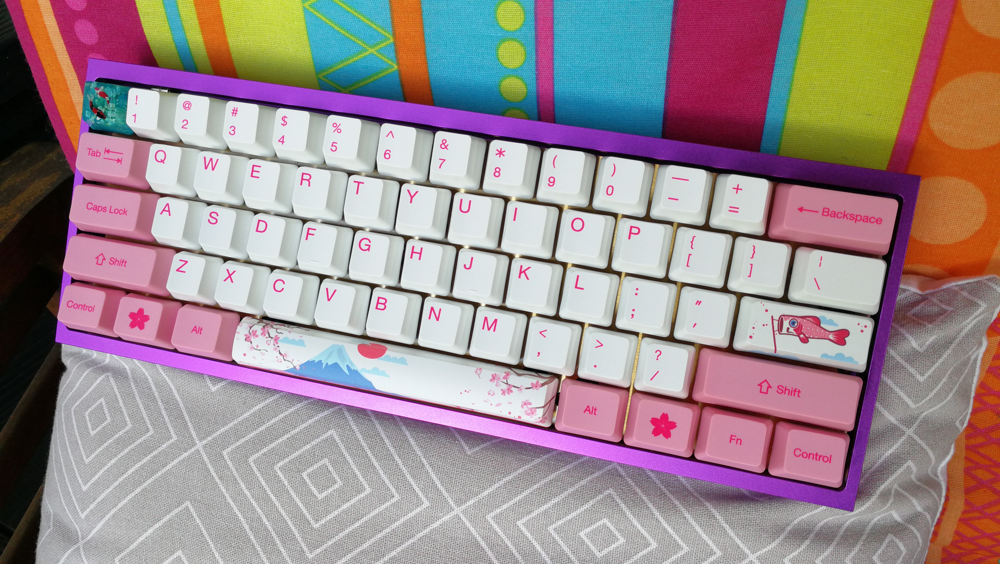
> Félicitations pour votre premier build ! 🎊

## Divers
Quelques dernières petites choses.

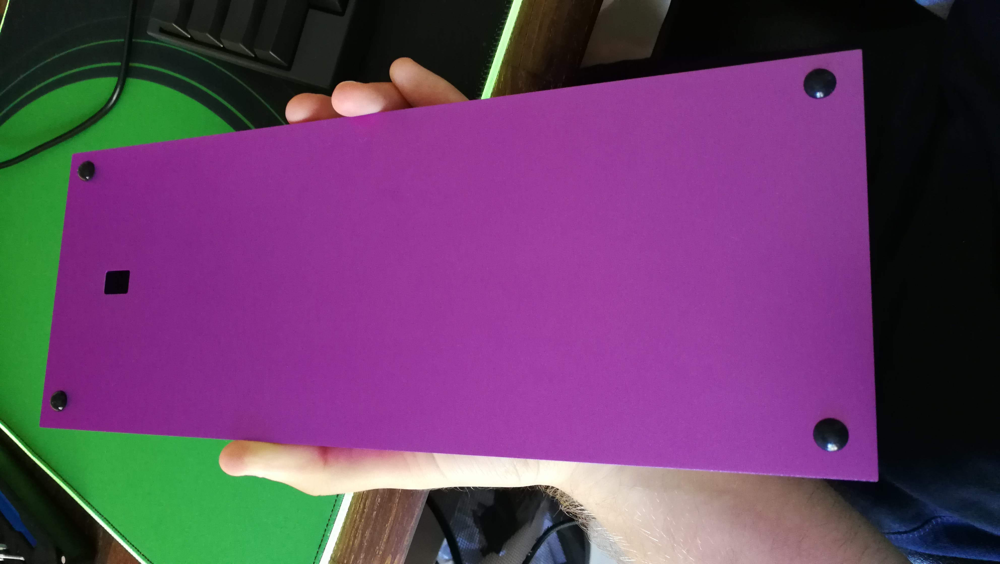
> N'oubliez pas de monter les petits pads antidérapants histoire de ne pas abimer votre boitier et aussi pour avoir davantage de grip sur le bureau.

> PS: Le petit trou dans le boîtier sert à appuyer sur un bouton au dos du PCB. Nous n'en avons pas besoin ici car notre PCB se flash d'une autre façon (il n'y a donc aucun bouton a cet emplacement), le boitier est juste prévu pour être universel et s'adapter au plus grand nombre de PCB.

### Comment flasher mon PCB ?
_"Ok, c'est bien beau d'avoir un clavier mais comment je custom les macros, mapping, règle la RGB etc moi ??"_

Cela dépend de votre OS dans un premier lieu et...je vais vous rediriger vers un autre guide car celui-la est basé sur le build d'un méca, puis il est deja suffisamment long comme ca.

Voici un [lien vers une playlist](https://youtu.be/VR53Wo9Z960?list=PLZlceRZZjRugJFL-vnenYnDrbMc6wu_e_) en anglais de la procedure a suivre. C'est un guide temporaire, en attendant que notre communauté rédige un guide spécifique et détaillé !

### Besoin d'aide / réclamation / autre ?

Si jamais ce tuto n'est pas suffisamment clair, que vous souhaitez y apporter des améliorations ou que vous êtes fan de Christian Clavier, n'hésitez pas à visiter notre [Discord](https://discord.gg/TZ5kBcQ), on sera heureux de vous accueillir ! 💪🏻🎉

-----

-----
##### Todo
- [ ] make better photos ? (light, crop, more indications)
- [ ] re-read myself
- [ ] add some photos ?
- [ ] fix some mistakes (add more lube on stab wires ?) vu que c'est mon premier build
